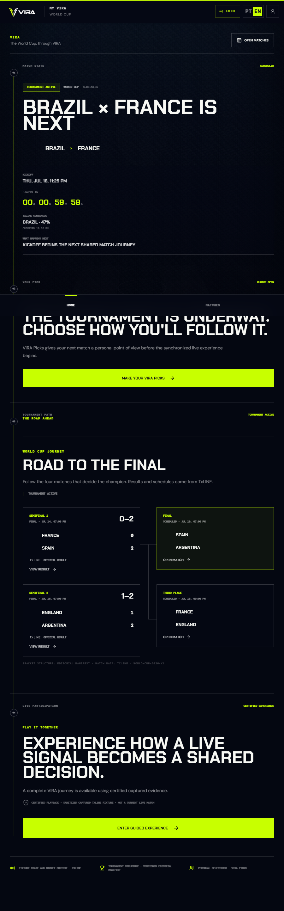
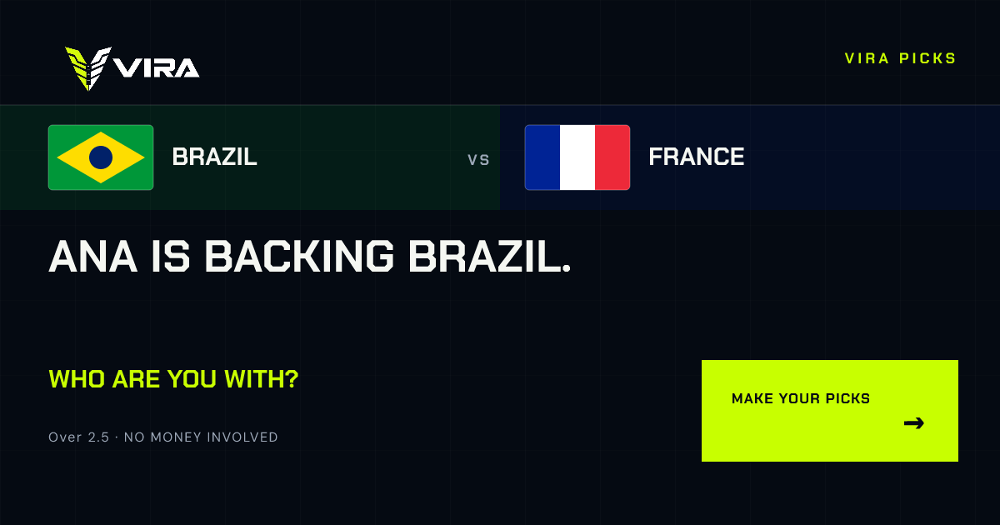
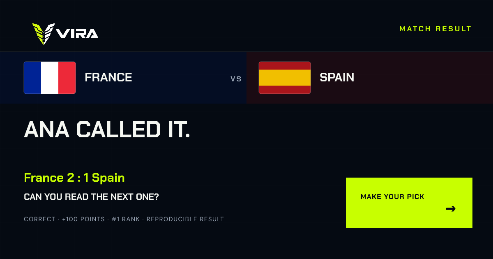
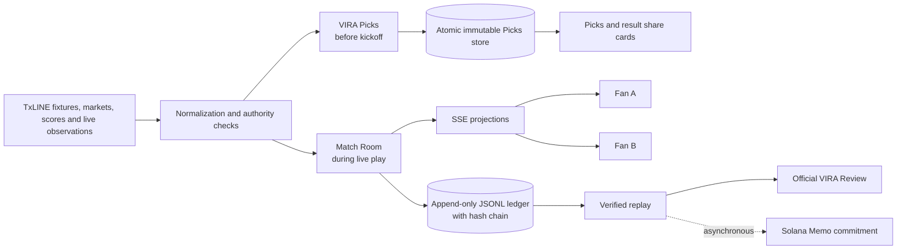

<div align="center">
  

  # VIRA

  **Play the match live with your friends.**

  VIRA turns authoritative football moments into synchronized multiplayer challenges powered by TxLINE.

  [](https://vira.snelabs.space/?lang=en)
  [](https://www.youtube.com/watch?v=LnOd2kWTiGA)
  [](https://vira.snelabs.space/help?lang=en)

  **Active public deployment · TxLINE-powered · deterministic replay · optional Solana devnet commitments**
</div>

<br />

[](https://www.youtube.com/watch?v=LnOd2kWTiGA)

## The match becomes the game

Most football products ask fans to watch a feed. VIRA lets them play the unfolding match together.

Fans enter instantly as guests. Before kickoff, they can make and share an immutable VIRA Picks card. During the match, they join a shared Match Room and answer short challenges opened by what is happening on the pitch. Answers stay private until one server-owned deadline. The next eligible TxLINE observation resolves the same rule for everyone, then points, streaks and ranking update together.

```text
TxLINE match event
        ↓
synchronized challenge
        ↓
private answers → authoritative lock
        ↓
shared result → ranking → verifiable replay → share
```

No wallet, OAuth, purchase or installation is required for the fan experience. Solana is used by the backend to activate TxLINE access and optionally anchor a resolved replay hash.

## One match, two social experiences

VIRA creates a continuous fan journey around the same authoritative fixture rather than limiting engagement to the live whistle-to-whistle window.

| | **VIRA Picks · before kickoff** | **Match Room · during live play** |
| --- | --- | --- |
| **Fan action** | Confirm 1–3 structured predictions, share the immutable card and invite friends to make their own. | Answer synchronized football challenges, follow live pressure signals and compete together. |
| **TxLINE authority** | Fixture lifecycle, kickoff, allowlisted market snapshots and regular-time result. | Live score, provider sequence, football observations and eligible post-lock signals. |
| **Social loop** | Pick → confirm → share → compare official results. | Join → answer → resolve → streak → rank → share. |
| **Isolation** | Dedicated atomic Picks store and deterministic selection resolvers. | Independent append-only competitive ledger, replay and Mini League ranking. |

Both experiences reuse the same guest identity and social distribution layer, but Picks never mutates Match Room points, answers, replay or ranking. There is no stake, payout, prize or combined probability.

## Judge fast path — under three minutes

**Permanent certified path — available even after the tournament ends**

1. Open the [Judge Evaluation Guide](https://vira.snelabs.space/help?lang=en).
2. Start the canonical [Guided Playback](https://vira.snelabs.space/match/judge-playback-france-spain-v2?lang=en), explicitly identified as a sanitized captured TxLINE fixture rather than a current live match.
3. Experience the complete sequence: ten-second countdown → kickoff → synchronized round → private answer → server lock → TxLINE signal → shared resolution → France 2–1 Spain.
4. Finish on the terminal share card, then use **Replay from start** or **Inspect evidence** to verify the journey again.

The Guided Playback reuses the production Consumer projections and preserves the ordering of the captured TxLINE evidence. It does not enter the official World Cup bracket or present the captured result as current live delivery.

**Available around a scheduled fixture**

1. Open the [live app](https://vira.snelabs.space/?lang=en), choose an eligible scheduled fixture and enter VIRA Picks.
2. Confirm an immutable card, share it and open the link in an anonymous or mobile window.
3. Create a second card with another guest identity and verify that both cards remain independent.

**During a live fixture**

1. Enter the same Match Room from two windows with different names.
2. Compare the synchronized round, private answer state, server-owned deadline and Mini League membership.
3. Watch both screens receive the same TxLINE-driven resolution and updated ranking.

```text
Pick → Share → Join → Play → Resolve → Rank → Verify
```

The canonical demo shows the complete experience, two isolated participants and the real TxLINE integration path. The [judge walkthrough](docs/JUDGE_WALKTHROUGH.md) provides the operational version of the same flow.

## Product journey

<p align="center">
  <a href="docs/images/vira-world-cup-journey.png"></a>
  <a href="docs/images/vira-picks-share.png"></a>
  <a href="docs/images/vira-match-result-share.png"></a>
</p>

| **World Cup Now → Road to the Final** | **VIRA Picks → social invitation** | **Match Room → resolved and shareable** |
| --- | --- | --- |
| Understand the current tournament state, personal context and official path before entering a match. | Confirm an immutable pre-match point of view and invite a friend to make their own. | Resolve the synchronized decision, update points and ranking, then turn the outcome into the next invitation. |

The gallery uses sanitized, deterministic TxLINE test fixtures so each state remains inspectable when no match is active. The tournament structure is editorially versioned; match participants, status, kickoff and results remain TxLINE-owned. Live production uses the same Consumer UI and authority checks.

## Why VIRA stands out

| Fan value | What VIRA delivers |
| --- | --- |
| **Instant access** | Guest entry with no wallet or account ceremony. |
| **A reason to keep watching** | Short challenges driven by meaningful football conditions rather than constant market noise. |
| **A shared live moment** | Server-authoritative deadlines and SSE projections keep every participant on the same round. |
| **Friendly competition** | Points, streaks, ranking and implicit Mini Leagues emerge from room invitations. |
| **Return loops** | Share cards and optional Web Push bring fans back for a new round or resolved result. |
| **Trust** | Every verified result can be reproduced from an append-only, hash-chained event ledger. |
| **Mainstream positioning** | No money, payout, betting position or token purchase is part of the Consumer experience. |

## Evaluation evidence

Reviewers can inspect the [architecture](docs/ARCHITECTURE.md), [integrity model](docs/INTEGRITY_MODEL.md), [public playback evidence](https://vira.snelabs.space/public/playback), [operations surface](docs/OPERATIONS.md) and [three-minute evaluation guide](docs/JUDGE_GUIDE.md). Hackathon-specific scoring and walkthrough details remain in the judge guide rather than defining the product narrative.

## TxLINE is the live authority

TxLINE is not decorative content in VIRA. It provides the fixture identity, competition, market baseline, provider sequence and football observations that drive the runtime.

| TxLINE input | VIRA use |
| --- | --- |
| Fixture snapshot | Match discovery, competition identity, kickoff and room configuration. |
| Score snapshot and updates | Scoreboard reconciliation, football actions and authoritative match lifecycle. |
| Historical scores | Deterministic inspection and replay from real provider records. |
| Odds snapshot and updates | Canonical full-match 1X2 context and pre-match prediction. |
| Allowlisted market snapshots | Immutable VIRA Picks context for regular-time result and exact Total Goals 2.5. |
| Score stream | Live football observations delivered to active Match Rooms. |
| Odds stream | Live market observations supported by the runtime adapter. |
| Pressure observations | Normalized possession, attacking possession, defensive possession and dangerous possession cues for live UX. |

The catalog refreshes automatically, rotates the featured fixture and reconciles `live → finished → next scheduled` without preserving a completed match as the active hero. Home, Match Preview and the match archive use the same server-owned Consumer projection, including a dedicated post-game experience.

VIRA deliberately fails closed when authority is missing or stale. It does not invent lineups, players or unsupported market facts. The complete mapping is documented in [TxLINE Endpoint Map](docs/TXLINE_ENDPOINT_MAP.md).

### VIRA Picks market allowlist

| Consumer question | Availability |
| --- | --- |
| **Regular-time match result** | Available from the observed canonical `1X2_PARTICIPANT_RESULT` market. |
| **Regular-time Total Goals 2.5** | Available only when TxLINE supplies one exact `OVERUNDER_PARTICIPANT_GOALS` observation with literal `line=2.5` and complete `over/under` options. Acquisition freshness and market-observation freshness are validated separately. |
| **Both teams to score** | Intentionally unavailable until a corresponding TxLINE market is observed, sanitized and certified. The resolver exists but is not exposed to selection, consensus or sharing. |

VIRA never substitutes a similar market, accepts a browser-supplied price or calculates a combined card probability.

### Demo disclosure

The competitive walkthrough uses a sanitized captured TxLINE test fixture so judges can see the complete open → answer → lock → resolve loop after live activity has ended. It is explicitly labeled `captured_txline_test_fixture` in the video and evidence artifacts.

A separate demo segment shows the real production TxLINE path. Normal operation uses the same normalizer, runtime, reducer, ledger and Consumer UI; only the deterministic capture input is controlled.

## Architecture



The browser never decides the deadline, winning option, score or ranking. Room mutations are serialized server-side, answers are timestamped at admission and only the first eligible post-lock provider signal can resolve a competitive round.

### Integrity contract

- A round has its own immutable version and absolute `locksAt` deadline.
- Individual choices and option splits remain private before lock.
- Duplicate answers are rejected with `409`.
- `round.locked` is persisted before resolution and is idempotent.
- Only answers admitted before the deadline can score.
- Provider observations retain acquisition origin, endpoint and sequence evidence.
- Internal test events cannot produce a verified TxLINE verdict.
- Replay, projection and ranking must agree after restart.
- Public verification never exposes participant identity, session tokens or individual choices.

## Solana: two distinct responsibilities

VIRA keeps its Solana responsibilities explicit:

1. **TxLINE subscription** — the project wallet subscribes to the free TxLINE devnet service level, signs the activation message and receives backend API credentials. See [TxLINE Solana Subscription Evidence](docs/TXLINE_SOLANA_SUBSCRIPTION_EVIDENCE.md).
2. **VIRA replay commitment** — after a verified resolution, VIRA can asynchronously anchor the exact replay hash through the Solana Memo Program. Resolution never waits for the chain. See the [confirmed devnet evidence](docs/p1-c-devnet-evidence.json) and [Explorer transaction](https://explorer.solana.com/tx/2P4ZUus1epocVRUr8BvC59VvQTTJGjRPNGUDQ3K2gfTJqvPzG8r66U8PsKdEPxQzsfJxCN9GMXhKBXNA23G6XTJh?cluster=devnet).

## Commercial path

VIRA is a B2B2C fan-engagement layer. Fans play for free; partners pay to operate and distribute the experience around licensed sports data.

| Offer | Buyer | Value |
| --- | --- | --- |
| **Sponsored Match Room** | Brands and broadcasters | Own the live fan interaction around one high-attention fixture. |
| **Tournament Package** | Organizers and media partners | Run a consistent engagement layer across an entire competition. |
| **Creator Mini League** | Creators and sports communities | Turn an audience into a recurring match-day group. |
| **White-label Experience** | Clubs, apps and rights holders | Embed the challenge engine with partner identity and distribution. |

The measurable funnel is:

```text
share created → invite opened → guest joined → live answer
→ return alert → result viewed → result shared
```

Commercial reporting can price and optimize distribution around qualified joins, answer rate, return rate, share conversion and repeat participation — not merely logo impressions.

### Commercial materials

The commercial narrative is available in three focused five-page decks rather than forcing every partner into the same presentation.

| Material | Best for | Focus |
| --- | --- | --- |
| [VIRA — Synchronized Participation](docs/VIRA_Synchronized_Participation.pdf) | TxODDS judges, broadcasters and rights holders | The complete product journey, TxLINE authority chain, reproducibility and B2B2C participation model. |
| [Matchday Brand Rituals](docs/Matchday_Brand_Rituals.pdf) | Sponsors, agencies and brand activation teams | A protected sponsored-fixture format, measurable participation funnel and focused pilot scope. |
| [Synchronized Football Engagement](docs/VIRA_Synchronized_Football_Engagement.pdf) | Product, engineering and commercial reviewers | Core positioning, product architecture, partner value and monetization paths. |

Product images in these decks that demonstrate deterministic end-to-end states are explicitly identified as captured TxLINE test fixtures. They are not represented as active live delivery, and none of the commercial formats introduces wagering or financial incentives.

## Production evidence

The canonical Demo V2 evidence package is pinned to release [`vira-demo-final-v2-2026-07-16`](https://github.com/4LFR3Dv1/VIRA-/releases/tag/vira-demo-final-v2-2026-07-16) at commit [`ec46a28`](https://github.com/4LFR3Dv1/VIRA-/commit/ec46a28c730388d5f7e449c11b801b92b5edf82a). Its video masters, captions, thumbnail, metadata and certification manifest are SHA-256 certified within that release.

[](https://github.com/4LFR3Dv1/VIRA-/actions/workflows/verify.yml)

At that release gate:

- production build passed;
- the complete automated verification suite passed across contracts, runtime, replay, Picks and Consumer journeys;
- the two-device Consumer E2E passed with isolated identities and equivalent rankings;
- public read-only smoke tests passed on Chromium desktop, Chromium mobile viewport and Mobile WebKit;
- the deployed Consumer projection agreed across Home, Lobby and Match Preview;
- the public verified replay preserved hash-chain, projection and ranking equivalence;
- the deployment exposed healthy readiness, persistent storage and configured TxLINE devnet access.

Public operational endpoints:

```http
GET /health
GET /ready
GET /operational/metrics
GET /public/playback
```

The canonical video package includes its own [metadata](scripts/demo/vira-demo-metadata.md), [certification manifest](scripts/demo/vira-demo-certification.json), captions and reproducible composition timeline.

## Technology

- **Consumer:** React 18, TypeScript, Vite, Motion and responsive PWA assets.
- **Runtime:** Node.js, serialized room queues and Server-Sent Events.
- **Persistence:** append-only JSONL event store, optimistic concurrency and hash chaining.
- **Pre-match Picks:** typed immutable cards, canonical SHA-256 market snapshots and a dedicated atomic single-writer store.
- **Sports data:** TxLINE fixtures, odds, scores, updates, historical records and streams.
- **Blockchain:** Solana/Anchor for TxLINE activation; Solana Memo Program for optional replay commitments.
- **Quality:** Node test runner, Playwright, deterministic fixtures and deployment audits.
- **Delivery:** Docker, Railway health gates and a persistent single-writer volume.

## Run locally

Requirements: Node.js 22+ and npm.

```powershell
git clone https://github.com/4LFR3Dv1/VIRA-.git
cd VIRA-
npm install
Copy-Item .env.example .env
npm run backend:dev
```

In another terminal:

```powershell
npm run dev
```

Default URLs:

```text
Frontend  http://127.0.0.1:5173
Backend   http://127.0.0.1:8787
```

The UI can boot without TxLINE credentials for local contract work. A TxLINE-backed catalog requires the activation flow below.

## Activate TxLINE access

The automated devnet setup creates a local project wallet, requests devnet SOL, subscribes to service level `1`, signs the activation message, obtains the API token and tests the fixture snapshot.

```powershell
npm run txline:setup:devnet
```

For the documented mainnet real-time World Cup tier:

```powershell
npm run txline:setup:mainnet-realtime
```

Mainnet needs enough SOL for transaction fees. The World Cup free tier removes TxL data fees, not normal Solana transaction fees. Never commit `.env`, a wallet keypair, guest JWT or API token.

Minimum backend configuration:

```dotenv
TXLINE_NETWORK=devnet
TXLINE_JWT=<guest-jwt>
TXLINE_API_TOKEN=<activated-api-token>
TXLINE_FIXTURE_ID=<optional-fixture-id>
```

To inspect available fixtures and endpoint coverage:

```powershell
npm run txline:discover -- --limit 20
```

## Verify the product

Run the full release gate:

```powershell
npm run verify
```

Run the exact two-device flow referenced in the judge walkthrough:

```powershell
npm run test:e2e:two-device
```

Run the public verified playback contract:

```powershell
npm run test:judge-playback
```

Optional operational certification:

```powershell
npm run certify:match -- --cycles 3 --target https://vira.snelabs.space
npm run soak:match -- --target https://vira.snelabs.space --duration-sec 14400 --interval-sec 30
```

An accelerated certification must not be described as the four-hour wall-clock soak.

## API surface

### TxLINE adapters

```http
GET  /matches/catalog
GET  /txline/capabilities
GET  /txline/fixtures
GET  /txline/scores?fixtureId=...
GET  /txline/scores/updates?fixtureId=...
GET  /txline/scores/historical?fixtureId=...
GET  /txline/odds?fixtureId=...
```

### Match Rooms

```http
POST /rooms/:roomId/join
GET  /rooms/:roomId/state?participantId=...
GET  /rooms/:roomId/events
POST /rooms/:roomId/rounds/:roundId/answer
GET  /rooms/:roomId/txline/status
```

### VIRA Picks

```http
GET  /picks/fixtures/:fixtureId/catalog
POST /picks/cards
GET  /picks/cards/public/:publicCode
GET  /picks/fixtures/:fixtureId/me
POST /picks/cards/:cardId/share
POST /picks/cards/public/:publicCode/open
```

### Public verification

```http
GET /public/rooms/:roomId/events
GET /public/rooms/:roomId/projection
GET /public/rooms/:roomId/verification
GET /public/rooms/:roomId/rounds/:roundId/replay
GET /public/rooms/:roomId/rounds/:roundId/commitment
```

Authenticated room state requires the participant's Bearer session token. Internal ingest routes are disabled in Consumer deployments and require an explicit feature flag plus an administrative credential.

## Deployment

The included `Dockerfile` builds the frontend and serves the application and API from one Node process. `compose.yaml` mounts persistent state at `/var/lib/vira`.

```powershell
docker compose up --build -d
```

Production invariants:

```text
replicas = 1
VIRA_DATA_DIR = persistent mounted volume
VIRA_INTERNAL_INGEST_ENABLED = false
VIRA_ALLOWED_ORIGINS = deployed public origin
```

The current event store is deliberately single-writer. Horizontal replicas require replacing it with a transactional shared store.

## TxLINE developer feedback

What worked especially well:

- one normalized cross-competition model;
- consistent fixture identifiers across fixtures, scores and odds;
- provider sequences that support idempotent processing;
- historical records that make deterministic inspection possible;
- canonical market data that can be normalized once on the server.

Where we found friction:

- kickoff, observation, cache materialization and response-generation times must remain distinct;
- canonical full-match 1X2 needs careful selection among related periods;
- exceptional fixture states need explicit lifecycle handling;
- live feeds must degrade safely without the browser inventing freshness.

VIRA addresses these points through a server-side Consumer projection, explicit freshness policy, score reconciliation and fail-closed authority rules.

## Documentation

| Document | Purpose |
| --- | --- |
| [Architecture](docs/ARCHITECTURE.md) | Runtime topology, authority boundaries and scaling limit. |
| [Integrity Model](docs/INTEGRITY_MODEL.md) | Competitive properties, enforcement and non-guarantees. |
| [TxLINE Integration](docs/TXLINE_INTEGRATION.md) | Provider authority, acquisition, normalization and runtime modes. |
| [Replay and Evidence](docs/REPLAY_AND_EVIDENCE.md) | Ledger, public verification and reproducible evidence. |
| [Security](docs/SECURITY.md) | Assets, controls, privacy boundaries and residual risks. |
| [Operations](docs/OPERATIONS.md) | Deployment invariants, public probes and runbook entry point. |
| [Evaluation Guide](docs/JUDGE_GUIDE.md) | Permanent three-minute product and evidence path. |
| [Commercial Path](docs/COMMERCIAL_PATH.md) | Proposed B2B2C formats, measurable funnel and detailed materials. |

## Known limits

- The file event store supports one process and one persistent volume.
- VIRA Picks exposes only observed, certified market families; BTTS remains hidden until a real TxLINE mapping is captured.
- Mobile WebKit evidence uses emulation rather than a physical iPhone.
- The deterministic competitive demo uses a captured, explicitly disclosed TxLINE fixture.
- Long-running ledgers will eventually need snapshotting, compaction or a transactional store.

## Current status

**Active — live public deployment.** VIRA is operable as a single-replica product and maintains a permanent disclosed playback path. It is not represented as horizontally scalable, externally audited or continuously backed by a currently live match.

## License

No license file has been published. Source availability does not by itself grant reuse or redistribution rights; licensing remains an explicit maintainer decision.

## Public links

- **Live app:** https://vira.snelabs.space/?lang=en
- **PT-BR app:** https://vira.snelabs.space/?lang=pt-BR
- **Demo V2:** https://www.youtube.com/watch?v=LnOd2kWTiGA
- **Commercial pitch:** [VIRA — Synchronized Football Engagement](docs/VIRA_Synchronized_Football_Engagement.pdf)
- **Judge walkthrough:** https://vira.snelabs.space/help?lang=en
- **Public repository:** https://github.com/4LFR3Dv1/VIRA-

---

<div align="center">
  <strong>VIRA turns watching together into playing together.</strong><br />
  Powered by TxLINE. Verified by its event ledger. Built for every match-day group.
</div>
