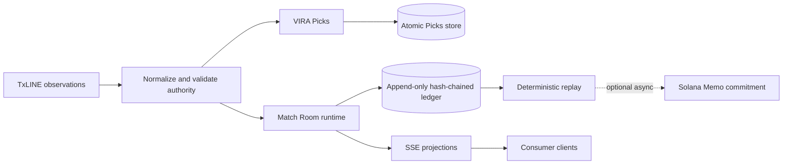

# VIRA Architecture

VIRA is a server-authoritative, single-writer real-time runtime. TxLINE observations enter through server-side adapters, are normalized against explicit authority and freshness rules, and feed two isolated product domains: pre-match VIRA Picks and live Match Rooms.

## Authority boundaries

- TxLINE owns fixture identity, lifecycle and eligible football observations.
- The server owns answer admission, absolute deadlines, locks, resolution, points and ranking.
- Browsers render projections and submit intent; they never decide competitive truth.
- Solana commitments attest to an already resolved replay hash and do not gate resolution.

## Storage and scaling boundary

The current event store is file-backed, append-only and deliberately single-writer. Production deployment therefore runs one application replica with a persistent volume. Horizontal replicas require a transactional shared event store and are not supported by the current architecture.

## Detailed references

- [Integrity model](INTEGRITY_MODEL.md)
- [TxLINE integration](TXLINE_INTEGRATION.md)
- [Replay and evidence](REPLAY_AND_EVIDENCE.md)
- [VIRA Picks domain](VIRA_PICKS.md)
- [Consumer cadence](CONSUMER_CADENCE.md)
- [PWA cache policy](pwa-cache-policy.md)

